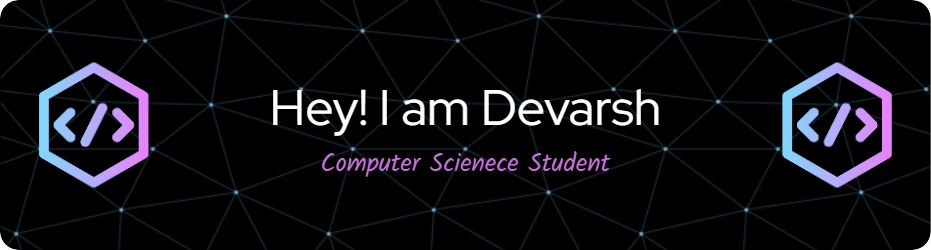

<h3 align="center">Grad Student at University of Texas, Arlington | IT Enthusiast</h3>

  

  

- 🌱 I’m currently learning **React.js, Kotlin**

- 💬 Ask me about **Python, Machine Learning, AI and Data Analytics**

- 📫 How to reach me **devarshvora45@gmail.com**

<h3 align="left">Connect with me:</h3>

<h3 align="left">Languages and Tools:</h3>

                      

